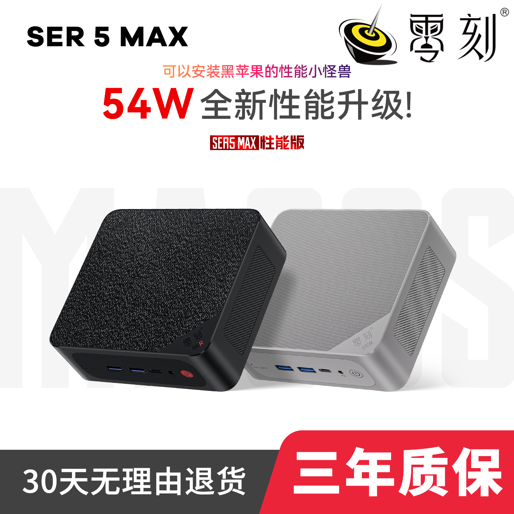
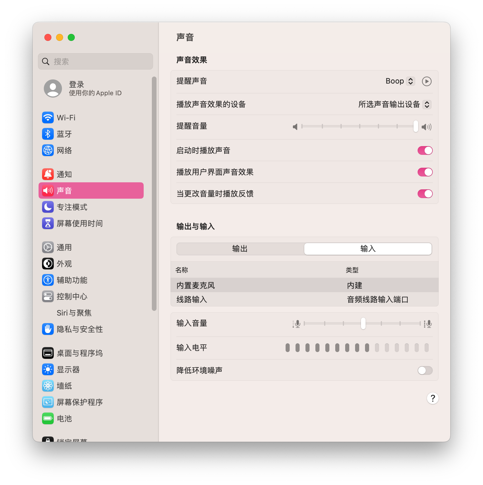
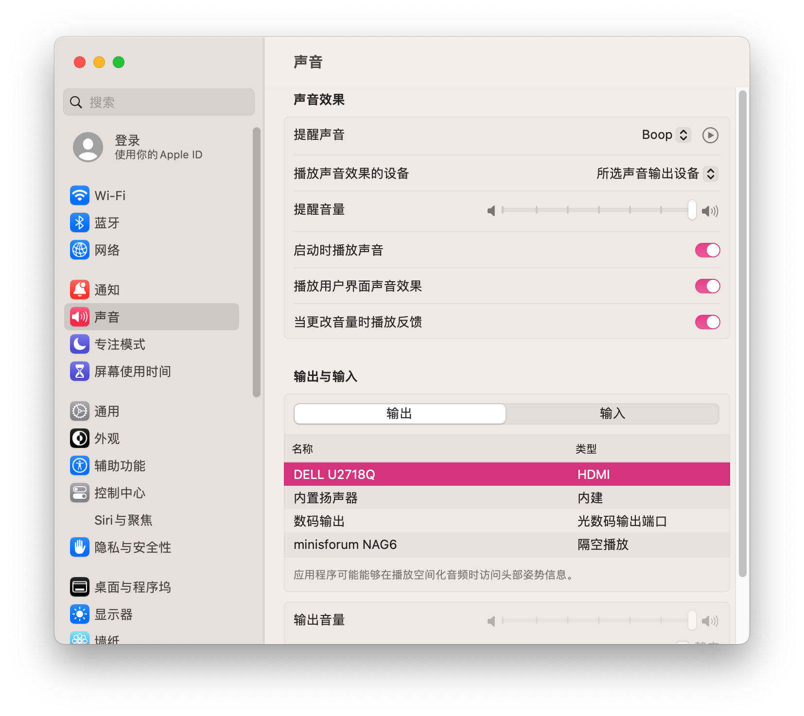
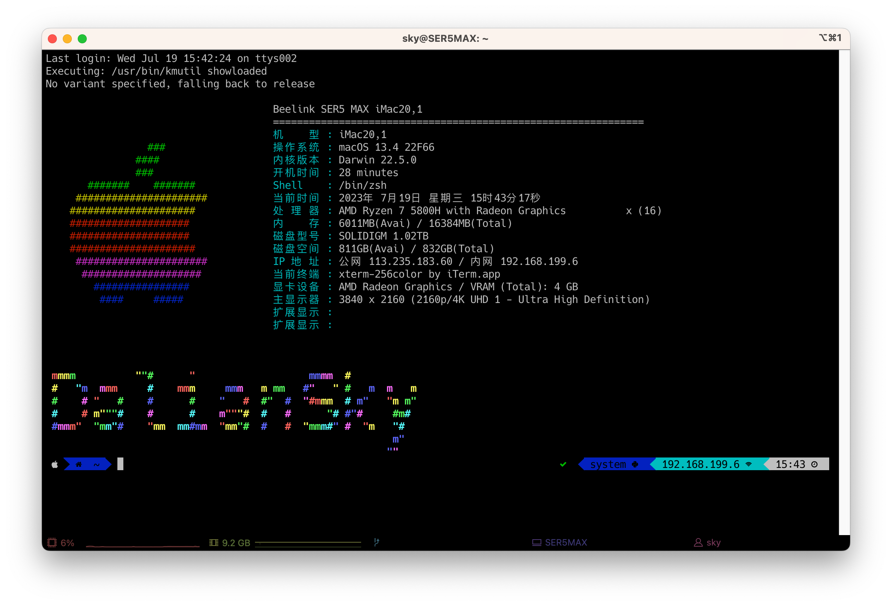

# Beelink-SER5-MAX-Hackintosh
> Beelink SER5 `PRO` / `MAX` Hackintosh

## 电脑配置

|   规格    |                           详细信息                           |
| :-------: | :----------------------------------------------------------: |
| 电脑型号  |                    Beelink SER5 PRO / MAX                    |
| 操作系统  | macOS `Sonoma` / `Ventura` /  `Monterey` / `Big Sur` / `Catalina` |
|  处理器   |                 AMD 锐龙 R5-5800H 8核16线程                  |
|   内存    |                      16 GB DDR4 3200MHz                      |
|   硬盘1   |                KINGSTON OM8PDP3512B-A01 512GB                |
|   硬盘2   |                    可接SATA 2.5寸硬盘/SSD                    |
|   核显    |      Radeon Vega Graphics 显存建议设置为：3GB/4GB       |
|  显示器   |                              无                              |
|   声卡    |                       USB Audio Device                       |
| 无线网卡  | m.2 NGFF插槽，默认出厂为 `Intel AX200` 已更换为[BCM94360Z3](https://blog.daliansky.net/uploads/WeChatandShop.png) |
| 有线网卡1 |               Intel Ethernet Controller I225-V               |

## 更新日志

- 3-15-2024
  - 更新 `IOSkywalkFamily.kext` 到 `v1.1.0`
  - `Sonoma` 如果想更新到 `14.4` 请务必先更新 `EFI` ，然后再安装 [OCLP](https://pan.daliansky.net/APPS/OCLP/OCLP.md)，重启后，再升级到 `14.4` 否则会出现 `WIFI` 无法启用的问题
- 9-7-2023
  - 重要更新：修复APU核显驱动卡顿问题
- 9-6-2023
  - 修复声卡驱动
    - 声卡支持输入/输出
- 8-16-2023
  - 更新 `OpenCore` 到 `v0.9.4` Release
  - 修复声卡驱动
    - 支持显示器音频输出

## 购买链接:

- [黑苹果定制版](https://item.taobao.com/item.htm?id=849425992734)
- [官方标配](https://u.jd.com/u6CAzYx)

## 截图

